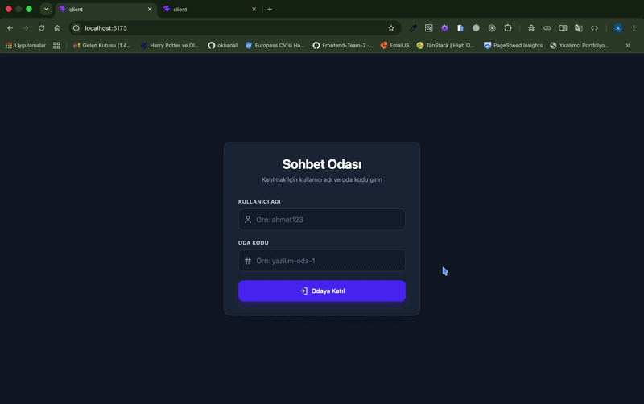

# 💬 Anlık Chat (Real-time Room-based Chat App)

React, TypeScript, Tailwind CSS ve Socket.io kullanılarak geliştirilmiş, oda tabanlı, modüler ve yüksek performanslı gerçek zamanlı mesajlaşma uygulaması.



---

## 🚀 Öne Çıkan Özellikler

- **Oda Tabanlı Mesajlaşma:** Kullanıcılar belirledikleri kullanıcı adı ve oda kodu ile anında sohbet odalarına katılabilir.
- **Canlı Bağlantı Durumu:** WebSocket bağlantı durumunu (Canlı / Kesildi) anlık olarak gösteren gösterge.
- **Atomic & Modüler Bileşen Mimarisi:**
  - **`FormField`:** Tekrar kullanılabilir, erişilebilir ve tip güvenli form girdileri.
  - **`MessageBubble`:** Gönderen, alıcı ve sistem mesajlarını dinamik olarak ayrıştıran mesaj balonları.
  - **`MessageInput`:** Form state'ini kendi içinde izole eden ve gereksiz re-render'ları önleyen mesaj girdi alanı.
- **Otomatik Kaydırma (Auto-scroll):** Yeni mesaj geldiğinde pürüzsüz kaydırma (`smooth scroll`) desteği.
- **Tip Güvenliği:** Strict TypeScript yapılandırması ile tam tip desteği.

---

## 🛠️ Kullanılan Teknolojiler

- **Frontend:** React 19, TypeScript
- **Styling:** Tailwind CSS v4
- **Icons:** Lucide React
- **Real-time Engine:** Socket.io Client
- **Build Tool:** Vite

---

## 📁 Proje Klasör Yapısı

```text
src/
├── components/
│   ├── FormField.tsx       # Atomik form girdi bileşeni
│   ├── MessageBubble.tsx   # Mesaj balonları (Sistem / Sen / Diğerleri)
│   ├── MessageInput.tsx    # Mesaj gönderme formu
│   ├── JoinRoom.tsx        # Oda katılım ekranı
│   └── ChatBox.tsx         # Ana chat paneli ve layout
├── types/
│   └── index.ts            # Mesaj ve socket tip tanımlamaları
├── App.tsx                 # Ana uygulama ve akış yönetimi
└── main.tsx                # Uygulama giriş noktası
```
